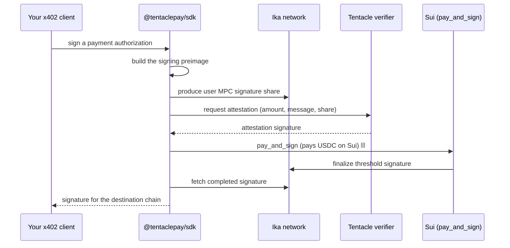

# @tentaclepay/sdk

> Pay for [x402](https://github.com/x402-foundation/x402) resources on any chain using a single wallet you custody on **Sui** — powered by [Ika](https://ika.xyz) 2PC‑MPC dWallets.

[](https://www.npmjs.com/package/@tentaclepay/sdk)
[](./LICENSE)

> ⚠️ **Testnet only.** Tentacle Pay is in active development and currently runs on Sui testnet with test USDC. Don't use real funds.

Tentacle Pay turns one Sui account into a wallet that can pay across chains. You hold USDC on Sui, and the SDK produces a valid payment authorization on whatever chain a paywalled resource asks for — no bridging, no second seed phrase, no key living on the destination chain.

Reach for this SDK when you (or your agent) need to pay for [x402](https://github.com/x402-foundation/x402)-protected APIs and content but you'd rather keep funds and keys in one place on Sui.

---

## Why Tentacle Pay

- **One wallet, many chains.** Fund once on Sui and pay resources on other networks. EVM ships today; the signing layer is curve-agnostic and built to extend (see [Supported targets](#supported-targets)).
- **No bridging.** Your USDC stays on Sui. The destination chain only ever receives a signature, not your assets.
- **No key on the destination chain.** The address that signs is a threshold dWallet on Ika — no single party (including you) holds its private key. A signature only finalizes when you authorize a payment on Sui.
- **Drop-in for x402.** The signer satisfies the standard x402 signer interface, so it slots into an existing x402 client with no changes to your request code.

---

## How it works

The address that signs your payments is a **shared dWallet** on the Ika network. Signatures are produced through threshold MPC and only complete once a payment lands on Sui.

When your x402 client needs to authorize a payment, the SDK:



The net effect: **funds move on Sui, the signature settles on the destination chain.** Your application just talks to a signer and never sees the cross-chain machinery.

---

## Installation

```bash
bun add @tentaclepay/sdk
```

Install the peer dependencies the SDK builds on:

```bash
bun add @mysten/sui @ika.xyz/sdk
```

To pay for x402 resources on EVM, also add the x402 client:

```bash
bun add @x402/evm
```

---

## Quick start

Create a signer for the chain you want to pay on and hand it to your x402 client. The example below pays on EVM:

```ts
import { createCrossChainEvmSigner } from "@tentaclepay/sdk/x402/evm";
import { Ed25519Keypair } from "@mysten/sui/keypairs/ed25519";
import { SuiClient, getFullnodeUrl } from "@mysten/sui/client";
import { IkaClient } from "@ika.xyz/sdk";

// 1. The Sui testnet keypair that funds your payments (test USDC + gas, on Sui).
const keypair = Ed25519Keypair.fromSecretKey(process.env.SUI_SECRET_KEY!);

// 2. A Sui client and an Ika client (see the Ika docs for network config).
const suiClient = new SuiClient({ url: getFullnodeUrl("testnet") });
const ikaClient = new IkaClient({ suiClient /* , testnet network config */ });

// 3. The Tentacle verifier that attests to each payment.
const verifierUrl = "https://verifier.testnet.tentaclepay.com";

// 4. A signer whose EVM address is your shared dWallet.
const signer = await createCrossChainEvmSigner(
  keypair,
  verifierUrl,
  suiClient,
  ikaClient
);

console.log(signer.address); // the address that will sign payments
```

`signer` satisfies the `@x402/evm` client signer interface, so you can plug it into an x402 client and call any 402-protected endpoint. When a resource returns `402 Payment Required`, the SDK runs the flow above and settles the payment on Sui — your request code stays the same.

---

## Supported targets

Payments today are made through the EVM signer (`@tentaclepay/sdk/x402/evm`), which authorizes the standard x402 `TransferWithAuthorization` (EIP‑3009) message.

Under the hood the dWallet signing layer is curve-agnostic and already covers the signature schemes used across the major ecosystems, so support is designed to grow beyond EVM:

| Curve | Signature schemes | Used by |
| --- | --- | --- |
| secp256k1 | ECDSA, Taproot | EVM chains, Bitcoin |
| secp256r1 | ECDSA (P‑256) | Passkey / WebAuthn-based accounts |
| ed25519 | EdDSA | Solana, Sui, Aptos, … |
| ed25519 | Schnorrkel (Substrate) | Polkadot / Substrate chains |

---

## Funding & fees

- You fund a single **Sui testnet** account. Each payment spends **test USDC on Sui** for the amount the resource requires, plus a small amount of SUI for gas.
- The destination chain never receives your funds — only a signed authorization the resource provider redeems on their side.

The Tentacle Pay testnet deployment the SDK points at:

| Constant | Value |
| --- | --- |
| `TENTACLEPAY_PACKAGE_ID` | `0x524cbabd8f4cd78f0913d638d10c101679e31ba4064603f82de6dee4fd59fd44` |
| `TENTACLEPAY_PROTOCOL_ID` | `0xb6e8b73d73164ed1a645bfa29d0e2d74bb2047ad935a0e93bd4d768a2a16bc30` |
| `USDC_COIN_TYPE` | `0xa1ec…7e29::usdc::USDC` |

These are exported from `@tentaclepay/sdk` if you need them directly.

---

## License

[MIT](./LICENSE)
